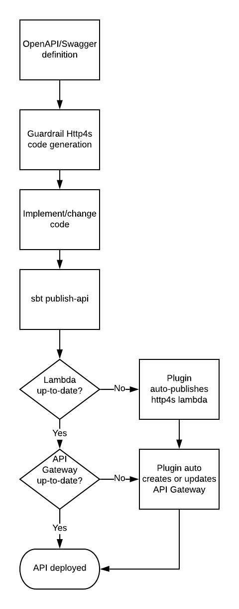

ioe# Http4s Lambda
Http4S bindings for AWS API Gateway &amp; Lambda

## Design goals
* Allow running a local Http4s server for a fast and productive development cycle.
* Allow running Http4s `Routes` to be used with no changes as an AWS Lambda (where the Lambda can be used as the target function for >1 API Gateway route).
* As a consequence of the two goals above, enable running Http4s as either a traditional JVM process, or as an AWS Lambda with no changes to code.
* Allow use of an OpenAPI/Swagger definition as the authoritative source of truth for the API with Guardrail code generation.
* Make deployment and updating an AWS API Gateway & Http4s Lambda as easy as `sbt publish-api` _if_ an OpenAPI/Swagger definition is used.
* Make use of as much existing plumbing as possible (Http4s obviously, most likely [Guardrail](https://guardrail.dev))

## Target deployment cycle

## Open questions
### How to deal with authorisation/authentication?
OpenAPI has hooks for this, but how do we make it transparent between AWS and a standalone process?
A standalone process would dictate something potentially implemented with Http4s, while AWS API Gateway would prefer using Lambda authorisers.
Ideally, we would come up with an approach that works in both context with minimal change.
